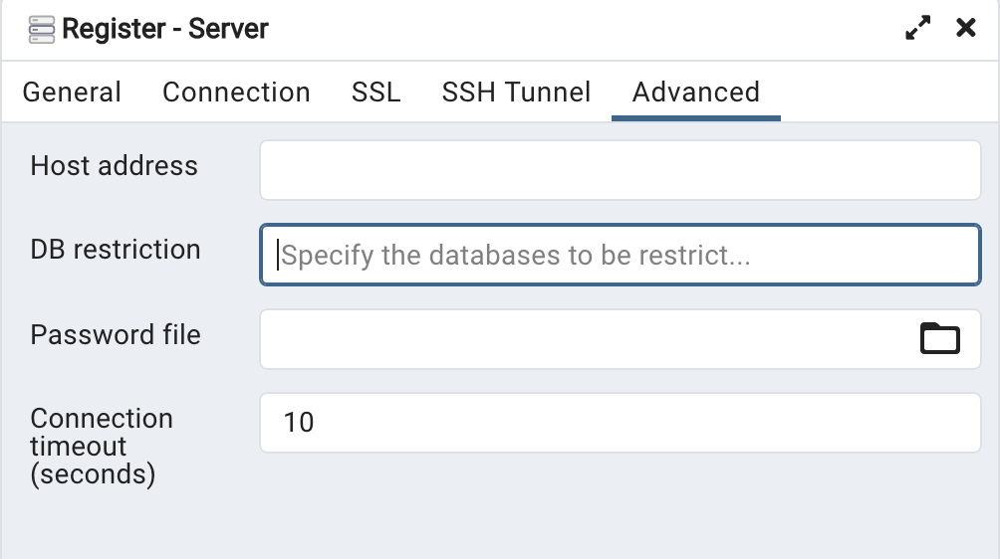

# ARTIS Database

## Installations

1. Download PostgreSQL: https://www.postgresql.org/download/
2. Download pgAdmin: https://www.pgadmin.org/download/

## Updating Cloud (Heroku) Database
*Reference: https://stackoverflow.com/questions/11769860/connect-to-a-heroku-database-with-pgadmin*

### Gathering Heroku database credentials:

1. Sign into the [Heroku platform](https://www.heroku.com/)
2. Click on the "artis" app

3. Click on the "Resources" tab

4. Click on "Heroku Postgres" in the list of resources available (this should open a new browser tab)

5. Click on the "Credentials" tab

6. Click on the arrow by "default 1 app" (this should provide a drop down set of options and details)
7. Click on the "show" button to reveal the password for the database

### Creating a connection between the Heroku Database and pgadmin:

1. Open pgAdmin
2. Right click on the Server list on the left hand side
3. Select Servers > Register > Server (this will open a new smaller window with additional settings)

4. Enter a server name (this will only be a local name reference) like "HEROKU_ARTIS"

5. Click on the "Connection" tab

The details needed to fill in the following information can be found on the Heroku credentials page we found earlier:

6. Enter the host name under the "Host name/address"
7. Enter the port number under the "Port" field
8. Enter the database name under the "Maintenance database" field
9. Enter the user name under the "Username" field
10. Enter the password (make sure to click reveal in Heroku) under the "Password"
11. Select Save password for future use
12. Click on "Advanced" tab

13. Enter the database name under the "DB restriction" field
(There should now be a new database connection in your pgAdmin dropdown)

### Test connection to Heroku database:
1. Click on server connection you created earlier (this will appear under the server name you wrote in earlier, ie "HEROKU_ARTIS")
2. Click the arrow by the server connection name (this should create provide a drop down with options and the 1 database)
3. Right-click on the database name in drop down options
4. Select the "Query tool" option (this should open a window in pgAdmin)

5. Run the SQL command "SELECT * FROM users;" (this should return immediately, with a table of the users that have access to the ARTIS API)

### Add new data to cloud database
1. Find the tables drop down under the database connection options on the left hand side of pgAdmin

Repeat the following instructions for each table you want to update:

1. If the table already exists:
 - Right click on the existing table and select the "Delete/Drop" option
 
 
2. Right-click on the database name in drop down options
3. Select the "Query tool" option (this should open a window in pgAdmin)
4. Paste and run the SQL script for creating the table you are interested in updating
5. Right-click the "Tables" dropdown and select "Refresh"

6. Right-click on the table you just re-created, and select "Import/Export Data" (this will open a new dialog box)

7. Confirm the "Import" tab is selected and use the "Filename" field to find the table data you would like to include.

9. Select the "Options" tab
8. Confirm the "Header" toggle is activated and the "NULL Strings" field has the value "NA"

9. Select the "Columns" tab
10. Make sure the "record_id" column IS NOT part of the "Columns to import" field. If it is please delete this column from the list.

## Directory and File Structure

- prep_db_files.R
  - Takes raw snet files to a database table
- create_sql_tables
  - SQL files to create the different tables
  

## Database Structure

### ARTIS snet table

| Column Name | Description |
| ----------- | ----------- |
| exporter_iso3c| ISO3C code for direct ***exporter*** country |
| importer_iso3c| ISO3C code for direct ***importer*** country |
| source_country_iso3c | ISO3C code for the country that produced the specific product |
| dom_source | Defines whether trade record was a "domestic export", "foreign export" or "error export" |
| hs6 | HS 6 digit code used to identify what product is being traded. |
| sciname | species name traded under the specific HS product and 6-digit code. |
| habitat | classifies whether the specific species' habitat *(marine/inland/unknown)*. |
| method | defines method of production *(aquaculture/capture/unknown)*. |
| product_weight_t | product weight in tonnes. |
| live_weight_t | live weight in tonnes. |
| year | year in which trade occured. |

| exporter_iso3c | importer_iso3c | source_country_iso3c | dom_source | hs6 | sciname | habitat | method | product_weight_t | live_weight_t | year |
| ----------- | ----------- | ----------- | ----------- | ----------- | ----------- | ----------- | ----------- | ----------- | ----------- | ----------- |
| CAN | USA | CAN | domestic export | 030212 | oncorhynchus keta | marine | capture | 870.34 | 1131.45 | 2017 |
| CHL | ITA | PER | foreign export | 230120 | engraulis ringens | marine | capture | 344.889 | 1026.11 | 2017 |

***Note:***

  - ***Domestic Export:*** An export where the specific product was produced in the same country as it was exported from.
  
  - ***Foreign Export:*** An export where a specific product is imported from a source country and then re-exported by another country.
  
  - ***Error Export:*** An export that cannot be explained by domestic or foreign export records nor production records.

### Production table
This table has all FAO production records for all countries in ARTIS for 1996 - 2020.

| Column Name | Description |
| ----------- | ----------- |
| iso3c | ISO3 code for the producing country |
| sciname | species produced (matches with sciname column in sciname table) |
| method | production method *(aquaculture/capture/unknown)* |
| habitat | habitat where species resides *(marine/inland/unknown)* |
| live_weight_t | Live weight in tonnes. |
| year | Year species was produced. |

#### Sample Production table entry
| iso3c | sciname | method | habitat | live_weight_t | year |
| ----------- | ----------- | ----------- | ----------- | ----------- | ----------- |
| SWE | abramis brama | capture | inland | 7 | 2006 |

### SAU Production table
This table has all SAU production records for all countries in ARTIS for 1996 - 2019. Note all production is marine capture.

| Column Name | Description |
| ----------- | ----------- |
| country_name_en | Producing country name in english |
| country_iso3_alpha | Producing country ISO3 3 letter code |
| country_iso3_numeric | Producing country ISO3 numeric code |
| eez | Exclusive Economic Zone |
| sector | economic sector |
| sciname | species produced (matches with sciname column in sciname table) |
| year | Year species was produced |
| live_weight_t | Live weight in tonnes |

### Baci table
This table has all BACI bilateral trade records for all countries in ARTIS for 1996 - 2020.

| Column Name | Description |
| ----------- | ----------- |
| exporter_iso3c | ISO3 3 letter code for direct ***exporter*** country |
| importer_iso3c | ISO3 3 letter code for direct ***importer*** country |
| hs6 | HS 6 digit code used to identify what product is being traded |
| product_weight_t | product weight in tonnes |
| hs_version | HS code version for the year used |
| year | year trade occured |

### Countries table
This table contains metadata about countries in the ARTIS database.

| Column Name | Description |
| ----------- | ----------- |
| iso3c | ISO3 3 letter code for country |
| country_name | Country name in english |
| owid_region | Country's region as defined by Our World in Data |
| continent | Country's continent as defined by R countrycode package |

### Nutrient metadata table
This table contains the nutrient content per 100g of the species in the ARTIS database.

| Column Name | Description |
| ----------- | ----------- |
| sciname | species scientific name |
| calcium_mg | calcium content (mg) per 100 g of species |
| iron_mg | iron content (mg) per 100 g of species |
| protein_g | protein content (g) per 100 g of species |
| fattyacids_g | fatty acid content (g) per 100 g of species |
| vitamina_mcg | vitamin a content (mcg) per 100 g of species |
| vitaminb12_mcg | vitamin b12 content (mcg) per 100 g of species |
| zinc_mg | zinc content (mg) per 100 g of species |

### Complete consumption table
This table contains consumption estimates from trade.

| Column Name | Description |
| ----------- | ----------- |
| iso3c | ISO3 3 letter code of consuming country |
| hs6 | HS 6 digit code used to identify what product is being consumed |
| sciname | species scientific name |
| method | production method *(aquaculture/capture/unknown)* |
| habitat | habitat where species resides *(marine/inland/unknown)* |
| source_country_iso3c | ISO3 3 letter code of country of origin |
| dom_source | Defines whether trade record was a "domestic export", "foreign export" or "error export" |
| hs_version | HS code version for the year |
| population | population of consuming country (sourced from FAO) |
| year | year of consumption |

### Code max resolved taxa table
This is a conversion table to resolve a scientific name from higher order taxa (family, order, class etc) to a more specific species based on the HS product and HS version used.

| Column Name | Description |
| ----------- | ----------- |
| hs_version | HS code version for the year |
| hs6 | species scientific name |
| sciname | original scientific name determined by production records |
| sciname_hs_modified | more specific/resolved scientific name given hs version and hs product |

---

### Products table
This table contains information about what each HS 6-digit code represents.

| Column Name | Description |
| ----------- | ----------- |
| hs6 | HS 6-digit product code |
| description | Product description |
| presentation | Product form ***(fillet, whole, fats and oils, non-fish, non-fmp form, other body parts, other meat, livers and roes)*** |
| state | Product state ***(live, frozen, preserved, fresh, not for humans, reduced)*** |

#### Sample products table entry
| hs6 | description | presentation | state |
| ----------- | ----------- | ----------- | ----------- |
| 030212 | Fish; Pacific salmon (oncorhynchus spp.), Atlantic salmon (salmo salar), Danube salmon (hucho hucho), fresh or chilled (excluding fillets, livers, roes and other fish meat of heading no. 0304)| whole | fresh |

